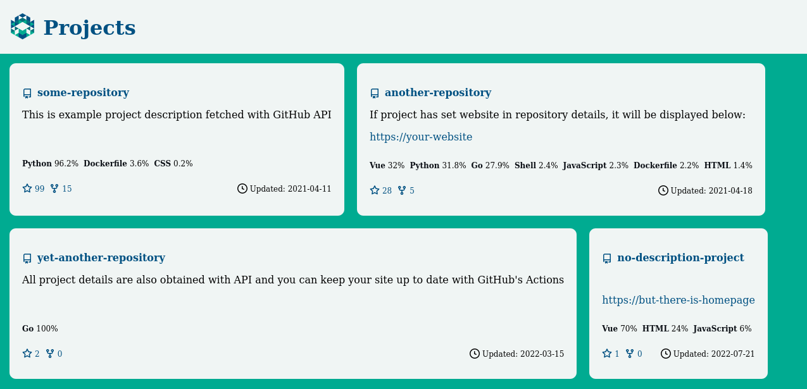

# GitHub pages generator

Generate and deploy minimalistic website with your repositories statistics with GitHub Actions.

**Key features:**

- lightweight, html and css only
- responsive, mobile friendly
- customizable and extensible

## Example workflow

- To run and deploy at 12:00pm every day:

  ```yaml
  name: Build and deploy website

  on:
    push:
      branches:
        - master
    schedule:
      - cron: "0 12 * * *"

  jobs:
    build:
      runs-on: ubuntu-latest
      steps:
      - name: Build
        uses: adamws/github-pages-generator@master
        with:
          github_token: ${{ secrets.GITHUB_TOKEN }}
          username: ${{ github.actor }}
          output_dir: ./output
      - name: Deploy
        uses: peaceiris/actions-gh-pages@v3
        with:
          github_token: ${{ secrets.GITHUB_TOKEN }}
          publish_branch: gh-pages
          publish_dir: ./output
  ```

- To run in `data-only` mode for creating `repositories.json` file at `output_dir` path,
  which can be used for integration with other tools:

  ```yaml
  jobs:
    build:
      runs-on: ubuntu-latest
      steps:
      - name: Get data
        uses: adamws/github-pages-generator@master
        with:
          github_token: ${{ secrets.GITHUB_TOKEN }}
          username: ${{ github.actor }}
          data_only: true
  ```

- Other examples:
  - [action's projects](https://adamws.github.io/github-pages-generator/example1) (default theme, trigger on [`master` push](https://github.com/adamws/github-pages-generator/blob/master/.github/workflows/main.yml))
  - [my projects](https://adamws.github.io/) (customized theme, trigger [on schedule](https://github.com/adamws/adamws.github.io/blob/master/.github/workflows/deploy-website.yml))

  

## Local usage

Clone this repository, install dependencies, build and serve:

```
git clone https://github.com/adamws/github-pages-generator.git && cd github-pages-generator
python -m venv .env
source .env/bin/activate
pip install -r requirements.txt
python github-pages-generator/build.py --username <<github username>>
cd output
python -m http.server
```

After that, open `http://0.0.0.0:8000/` in browser. Files from `output` directory can be
manually committed to `gh-pages` branch or your [GitHub Pages](https://docs.github.com/en/pages/getting-started-with-github-pages/about-github-pages) repository,
but it is recommended to set up automatic deployment with [GitHub Actions](https://github.com/features/actions) which will trigger
periodically, keeping your statistics up to date.

### Rate limits

GitHub's REST API has [rate limits](https://docs.github.com/en/rest/overview/resources-in-the-rest-api#rate-limiting)
which can be easily reached while experimenting with this tool. There are two mechanisms built-in
to circumvent that:

- requests are cached with [`requests-cache`](https://requests-cache.readthedocs.io/en/stable/index.html)
- requests can be optionally authenticated with [personal access token](https://docs.github.com/en/authentication/keeping-your-account-and-data-secure/creating-a-personal-access-token) via `GITHUB_USER` and `PERSONAL_ACCESS_TOKEN` environment variables.

